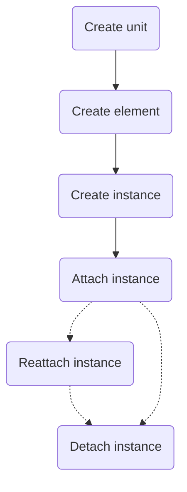
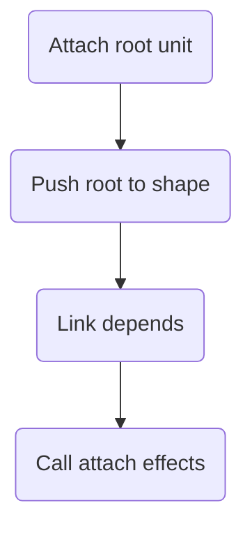
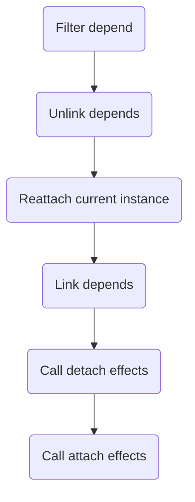
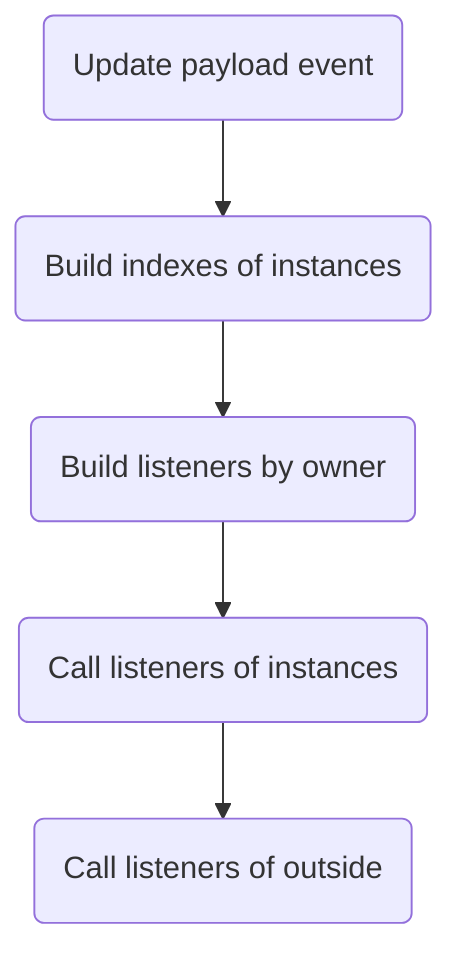

# Restarfall

Restarfall is a JavaScript library for creating business logic and data management.

## Usage

```ts
import { create, use } from "restarfall";

// Create store with value of count
const $count = create.store<number>(0);

// Create event for increase value of count
const inc = create.event<void>();

// Create unit with logic for count
const counter = create.unit(() => {
  // Use depend from event `inc`
  const incEvent = use.depend(inc);

  // Use value store of count
  const count = use.value($count);

  // Use dispatch for store of count
  const setCount = use.dispatch($count);

  // If the event was triggered change the value of the storage
  if (incEvent.called) setCount(count + 1);

  // Return null, because `counter` doesn't have children units
  return null;
});

// Create shape to run `counter`
const shape = create.shape();

// Attach and run `counter`
shape.attach(counter());
```

## Documentation

### You can

#### Create `store`

A store is some kind of key to use between units and other third-party libraries.

```ts
import { create } from "restarfall";

const $count = create.store<number>(0);
```

#### Create `event`

An event is some kind of key to use between units and other third-party libraries.

```ts
import { create } from "restarfall";

const inc = create.event<void>();
```

#### Create `unit`

The unit is required to create the logic of storage update and react to events correctly. The order of unit call execution is preserved even after dependency updates, which makes your code predictable.

```ts
import { create } from "restarfall";

const counter = create.unit(() => null);
```

#### Create `unit` with children units

You can use child units in the unit body in various variations.

> [!IMPORTANT]
> Calling a child unit inside a parent unit does not guarantee that the body of the child unit will be called. To call the body of the child unit, you must set it to the `return` of the parent unit.

```ts
import { create } from "restarfall";

// Without children
const setValue = create.unit(() => null);

// With two children
const update = create.unit(() => [setValue(), setValue()]);

// With one child
const counter = create.unit(() => update());
```

#### Use `arguments` for units

You can also use arguments in the unit body to fine-tune your application (reusing the unit for some dependency).

```ts
import { create } from "restarfall";

const update = create.unit((name: string, index: number) => null);

const counter = create.unit(() => [update("first", 0), update("second", 1)]);
```

#### Create `element` from unit and use one in other units

When a unit is called, an element is created that can be used either as a child unit or as a [rooted]() unit.

```ts
import { create } from "restarfall";

const update = create.unit((name: string, index: number) => null);

const firstUpdate = update("first", 0);
const secondUpdate = update("second", 1);

const counter = create.unit(() => [
  firstUpdate,
  secondUpdate,
  update("last", 99),
]);
```

#### Create `shape`

A shape is a certain context relative to which the attached units will be launched. The form stores the raw data (e.g. received via ssr), storage state, data with which events were called, event listeners, and units, both root and child units, to ensure the order in which units are called.

```ts
import { create } from "restarfall";

const shape = create.shape();
```

#### Attach `root-unit` to `shape`

For the created units to work, they need to be attached to the shape.

> [!NOTE]
> The order of joining affects the order of calling units.

```ts
import { create } from "restarfall";

const root = create.unit(() => null);

const shape = create.shape();

shape.attach(root());

// You can twice attach `root-unit` to `shape`
shape.attach(root());
```

#### Use `value` hook into unit

This hook is essential for working with storage data .

```ts
import { create, use } from "restarfall";

const $count = create.store<number>(0);

const counter = create.unit(() => {
  const count = use.value($store);
  return null;
});
```

#### Use `depend` hook into unit

This hook is required to subscribe to a storage change or event call. When subscribing to a storage change inside the hook, it is just subscribing to an event `$store.changed`. This is why the return value signatures of this hook are the same. When an event is called, the entire body of the unit will be recalled. The return values of this hook will contain an object `{ called: boolean: payload?: EventPayload }`.

> [!IMPORTANT]
> When a unit is called again, all child units are unsubscribed from their dependencies. This implementation ensures that an event occurring in the parent unit will not be triggered in the child unit and will not cause the child unit to be called again. In addition, it is possible to enable/disable large branches of business logic under certain conditions.

```ts
import { create, use } from "restarfall";

const $count = create.store<number>(0);
const inc = create.event<void>();

const counter = create.unit(() => {
  const countChanged = use.depend($count);
  const { called, payload } = use.depend(inc);
  return null;
});
```

#### Use `filter` for `depend` hook

The filter is necessary to optimise the call to the unit body.

```ts
import { create, use } from "restarfall";

const $count = create.store<number>(0);

const counter = create.unit(() => {
  const countChangedMore2 = use.depend($count, (count) => count > 2);
  return null;
});
```

#### Lock `depend`

Sometimes you just need to get the values of an event but not subscribe to it.

```ts
import { create, use } from "restarfall";

const $count = create.store<number>(0);

const counter = create.unit(() => {
  const countChanged = use.depend($count, false);
  return null;
});
```

#### Use `dispatch` hook into unit

This hook is required to change the storage or call an event in the unit body.

```ts
import { create, use } from "restarfall";

const $count = create.store<number>(0);
const inc = create.event<void>();

const counter = create.unit(() => {
  const changeCount = use.dispatch($count);
  const changeByInc = use.distpach(inc);

  setTimeout(() => changeCount(2), 1000);
  setTimeout(() => changeByInc(), 2000);

  return null;
});
```

#### Use `take` hook into unit

The data hook is needed to get the storage value when the unit body context is lost, e.g. in `setTimeout`.

```ts
import { create, use } from "restarfall";

const $count = create.store<number>(0);

const counter = create.unit(() => {
  const takeCount = use.take($count);
  const changeCount = use.dispatch($count);

  setTimeout(() => changeCount(takeCount() + 1), 1000);

  return null;
});
```

#### Use `promise` hook into unit

This hook will come in handy if you are using `ssr`. Using it you can wait for all asynchronous processes to execute.

```ts
import { create, use } from "restarfall";

const request = async () => ({ count: 2 });

const $count = create.store<number>(0);

const counter = create.unit(() => {
  const changeCount = use.dispatch($count);

  use.promise(request()).then(({ count }) => changeCount(count));

  return null;
});

const shape = create.shape();

shape.attach(counter());
shape.wait().then(() => {
  // all requests done
});
```

#### Use `cache` hook into unit

This hook is required to cache any data inside the unit body.

> [!NOTE]
> It can help with reducing the number of attachments/ detachments of child units, because the comparison of children of the previous and current steps is used for optimisation.

```ts
import { create, use } from "restarfall";

const counter = create.unit(() => {
  const countCache = use.cache<number>("count");
  const countByGet = countCache.get().value;
  const countByTake = countCache.take(() => 3);

  countCache.set(5);

  return null;
});
```

#### Use `cache` hook with added keys

This use of the hook will make it possible not to create an additional store for caching similar data types.

```ts
import { create, use } from "restarfall";

const counter = create.unit(() => {
  const countCacheFirst = use.cache<number>("count", "first");
  const countCacheLast = use.cache<number>("count", "last");

  countCacheFirst.take(() => 5);
  countCacheLast.take(() => 10);

  return null;
});
```

#### Use `detach` hook (effect) into unit

This hook is required to detect the event of detaching a unit element from the unit tree.

```ts
import { create, use } from "restarfall";

const $count = create.store<number>(0);

const counter = create.unit(() => {
  const setCount = use.dispatch($count);

  use.detach(() => setCount($count.initialValue));

  return null;
});
```

#### Use `attach` hook (effect) into unit

This hook is required to detect the attachment event of a unit element in the unit tree.

```ts
import { create, use } from "restarfall";

const $count = create.store<number>(0);

const counter = create.unit(() => {
  const setCount = use.dispatch($count);

  use.detach(() => setCount(4));

  return null;
});
```

#### Use `rawData` / `deserialize` / `serialize` into units and shape

These methods are necessary to implement the logic for `ssr`.

> [!IMPORTANT]
> Raw data cannot be deserialised again. For example, if there are two units that deserialise the same data, deserialisation will happen once.

> [!IMPORTANT]
> When deserialising, the value must be set correctly, otherwise you may get errors when trying to work with storage data.

```ts
import { create } from "restarfall";

const $count = create.store<number>(0);
const $token = create.store<string>("empty");

const counter = create.unit(() => null, {
  deserialize: (getValue) => ({
    count: {
      store: $count,
      value: getValue("_count_").value,
    },
    token: {
      store: $token,
      value: getValue("token_key").value ?? $token.initialValue,
    },
  }),
  serialize: (getValue) => ({
    _count_: getValue($count),
    _token_: getValue($count),
  }),
});

const shape = create.shape();

shape.setRawData({ _count_: 2 });
shape.attach(counter());

const data = shape.serialize(); // data equal { _count_: 2, _token_: "empty" }
```

#### Use created elements into parent unit

This technique can be used instead of caching elements inside the unit body, especially if the arguments of child units do not change dynamically.

```ts
import { create, use } from "restarfall";

const update = create.unit((name: string) => null);

const firstUpdate = update("first");
const lastUpdate = update("last");

const counter = create.unit(() => [firstUpdate, lastUpdate]);
```

### Examples

- [Counter](https://codesandbox.io/s/restarfall-counter-example-3qcqrf?file=/src/index.js)

- [Ticker](https://codesandbox.io/s/restarfall-ticker-example-838w3t?file=/src/index.js)

- [Validate field](https://codesandbox.io/s/restarfall-validate-field-5vv6jp?file=/src/model.js)

- [Auth form](https://codesandbox.io/s/restarfall-auth-form-vytkr2?file=/src/model-auth.js)

- [Toggler](https://codesandbox.io/s/restarfall-toggler-j2dqk8?file=/src/model.ts)

- [SetRawData / Deserialize / Serialize](https://codesandbox.io/s/restarfall-setrawdata-deserialize-serialize-mvzf89?file=/src/index.js)

### Unit life cycle

<details>
  <summary>Chart</summary>



</details>

### Algorithm for attaching a root-unit to a shape

<details>
  <summary>Chart</summary>



</details>

### Algorithm for updating a unit after a storage change or event call

<details>
  <summary>Chart</summary>



</details>

### Algorithm of event call

<details>
  <summary>Chart</summary>



</details>

## API

### Event

- [createEvent](https://github.com/EvgenyiFedotov/restarfall/blob/e47a392155e150ca12b971e465e4941ecec5970a/packages/restarfall/src/event.ts#L11-L13)

### Store

- [createStore](https://github.com/EvgenyiFedotov/restarfall/blob/e5f29d5f746ac4a54fbf27843e4549ea9d807c45/packages/restarfall/src/store.ts#L14-L16)

### Unit

- [createUnit](https://github.com/EvgenyiFedotov/restarfall/blob/82fcf6fd4f4e86803d8ae7c7238f7138368a8a26/packages/restarfall/src/unit.ts#L32-L37)

### Hooks

- [useValue](https://github.com/EvgenyiFedotov/restarfall/blob/13e6ecfd7c71c4045c8ab0dd49955f43cfd125dc/packages/restarfall/src/hooks.ts#L72-L74)

- [useDepend](https://github.com/EvgenyiFedotov/restarfall/blob/13e6ecfd7c71c4045c8ab0dd49955f43cfd125dc/packages/restarfall/src/hooks.ts#L22-L27)

- [useDispatch](https://github.com/EvgenyiFedotov/restarfall/blob/13e6ecfd7c71c4045c8ab0dd49955f43cfd125dc/packages/restarfall/src/hooks.ts#L53-L56)

- [useTake](https://github.com/EvgenyiFedotov/restarfall/blob/13e6ecfd7c71c4045c8ab0dd49955f43cfd125dc/packages/restarfall/src/hooks.ts#L84-L86)

- [usePromise](https://github.com/EvgenyiFedotov/restarfall/blob/13e6ecfd7c71c4045c8ab0dd49955f43cfd125dc/packages/restarfall/src/hooks.ts#L94-L96)

- [useCache](https://github.com/EvgenyiFedotov/restarfall/blob/12c999db000c8b22dba24f7589779c40ef257b48/packages/restarfall/src/hooks.ts#L112-L114)

- [useDetach](https://github.com/EvgenyiFedotov/restarfall/blob/12c999db000c8b22dba24f7589779c40ef257b48/packages/restarfall/src/hooks.ts#L129-L131)

- [useAttach](https://github.com/EvgenyiFedotov/restarfall/blob/12c999db000c8b22dba24f7589779c40ef257b48/packages/restarfall/src/hooks.ts#L139-L141)

### Shape

- [createShape](https://github.com/EvgenyiFedotov/restarfall/blob/e5f29d5f746ac4a54fbf27843e4549ea9d807c45/packages/restarfall/src/shape.ts#L103-L105)

<details>
  <summary>Methods of shape instance</summary>

#### Methods of data

- [setRawData](https://github.com/EvgenyiFedotov/restarfall/blob/ecaae9bf870361f1ed7a08bbcdd4b1888b6a8e00/packages/restarfall/src/shape.ts#L38)

- [serialize](https://github.com/EvgenyiFedotov/restarfall/blob/ecaae9bf870361f1ed7a08bbcdd4b1888b6a8e00/packages/restarfall/src/shape.ts#L39)

#### Methods of values

- [hasValue](https://github.com/EvgenyiFedotov/restarfall/blob/ecaae9bf870361f1ed7a08bbcdd4b1888b6a8e00/packages/restarfall/src/shape.ts#L42)

- [getValue](https://github.com/EvgenyiFedotov/restarfall/blob/ecaae9bf870361f1ed7a08bbcdd4b1888b6a8e00/packages/restarfall/src/shape.ts#L43)

- [setValue](https://github.com/EvgenyiFedotov/restarfall/blob/ecaae9bf870361f1ed7a08bbcdd4b1888b6a8e00/packages/restarfall/src/shape.ts#L44)

- [changeValue](https://github.com/EvgenyiFedotov/restarfall/blob/ecaae9bf870361f1ed7a08bbcdd4b1888b6a8e00/packages/restarfall/src/shape.ts#L45)

#### Methods of events

- [getEventState](https://github.com/EvgenyiFedotov/restarfall/blob/ecaae9bf870361f1ed7a08bbcdd4b1888b6a8e00/packages/restarfall/src/shape.ts#L55C14-L55C14)

- [unlistenEvent](https://github.com/EvgenyiFedotov/restarfall/blob/ecaae9bf870361f1ed7a08bbcdd4b1888b6a8e00/packages/restarfall/src/shape.ts#L56-L59)

- [listenEvent](https://github.com/EvgenyiFedotov/restarfall/blob/ecaae9bf870361f1ed7a08bbcdd4b1888b6a8e00/packages/restarfall/src/shape.ts#L60-L63)

- [callEvent](https://github.com/EvgenyiFedotov/restarfall/blob/ecaae9bf870361f1ed7a08bbcdd4b1888b6a8e00/packages/restarfall/src/shape.ts#L64-L67)

#### Methods of units

- [attach](https://github.com/EvgenyiFedotov/restarfall/blob/ecaae9bf870361f1ed7a08bbcdd4b1888b6a8e00/packages/restarfall/src/shape.ts#L70)

- [wait](https://github.com/EvgenyiFedotov/restarfall/blob/ecaae9bf870361f1ed7a08bbcdd4b1888b6a8e00/packages/restarfall/src/shape.ts#L71)
</details>

### Combined APIs for short import methods from library

This api was created to simplify the import of methods from the library.

- [create](https://github.com/EvgenyiFedotov/restarfall/blob/13e6ecfd7c71c4045c8ab0dd49955f43cfd125dc/packages/restarfall/src/index.ts#L7-L12)

- [use](https://github.com/EvgenyiFedotov/restarfall/blob/13e6ecfd7c71c4045c8ab0dd49955f43cfd125dc/packages/restarfall/src/index.ts#L13-L19)

## Tests (jest)

- [check value of store](https://github.com/EvgenyiFedotov/restarfall/blob/dd839eccae117c09a19930860054b2f5b2575988/packages/restarfall/src/__tests__/test-examples.spec.ts#L7-L19)

- [check state of event](https://github.com/EvgenyiFedotov/restarfall/blob/dd839eccae117c09a19930860054b2f5b2575988/packages/restarfall/src/__tests__/test-examples.spec.ts#L21-L33)

- [async check value of store](https://github.com/EvgenyiFedotov/restarfall/blob/dd839eccae117c09a19930860054b2f5b2575988/packages/restarfall/src/__tests__/test-examples.spec.ts#L35-L54)
